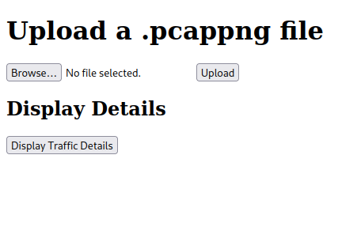

# Wireshark visualiser

## Prerequisites
1. Kali linux \
Kali linux can be installed directly on the machine or can be installed in a VM (virtual machine). It is recommended to install it in a virtual machine since it ensures the stablility of your base OS. [Virtual Box](https://www.virtualbox.org/wiki/Downloads) is a free Virtual Machine emulator and we need Kali Linux [Virtual Box 64 bit](https://www.kali.org/get-kali/#kali-virtual-machines) version to go alongside it. \

- Dependencies on Kali linux
    1. tshark
2. Python 3.8+
```
sudo apt update
sudo apt install python3-pip
```
3. Pip
    1. Pandas
    ```
    pip install pandas
    ```
    2. Flask
    ```
    pip install flask
    ```
## Technologies used
1. HTML5, CSS3, JS
2. Bootstrap 5
3. Python
    1. Flask
    2. Pandas
4. Kali linux - tshark

## Running the app
Navigate to the folder and open the terminal in current working directory
```
python3 app.py 
```
A site will be opened [here](http://127.0.0.1:5000) open it and then upload your **.pcapng** file and then can click on display traffic details part to visualise the data. \
